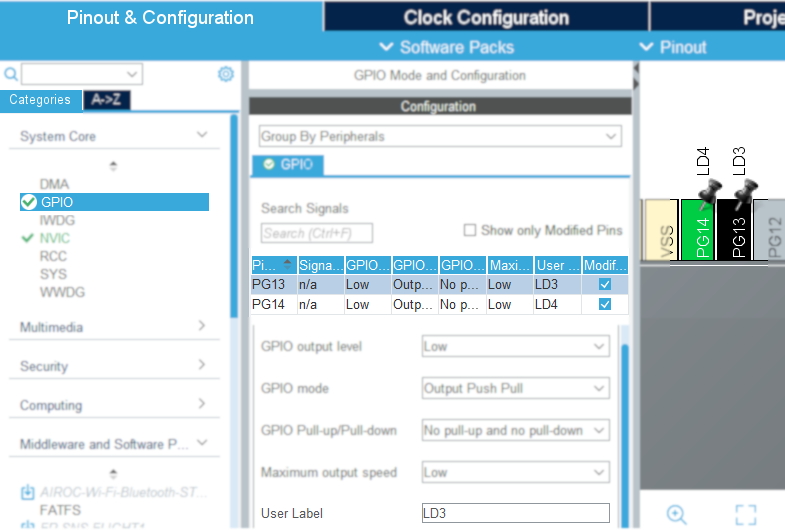
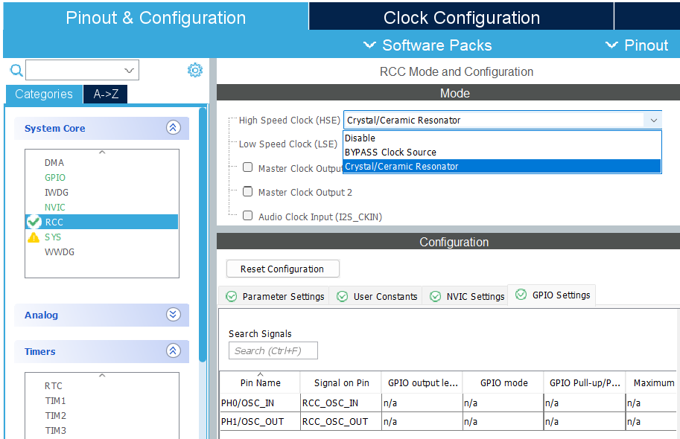
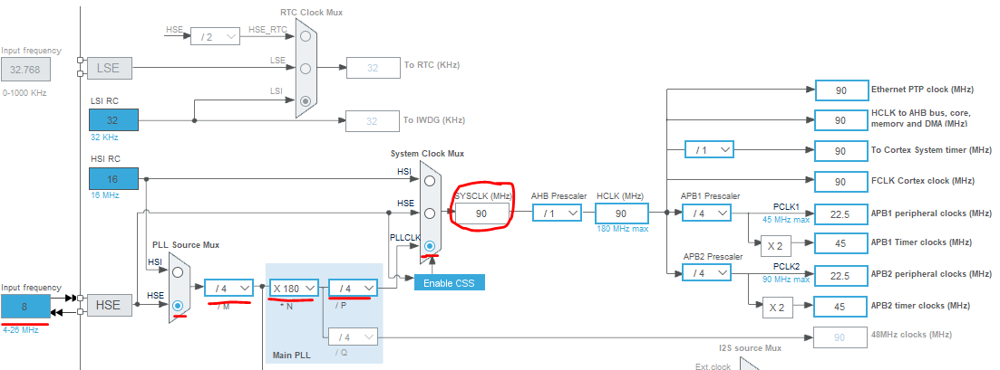
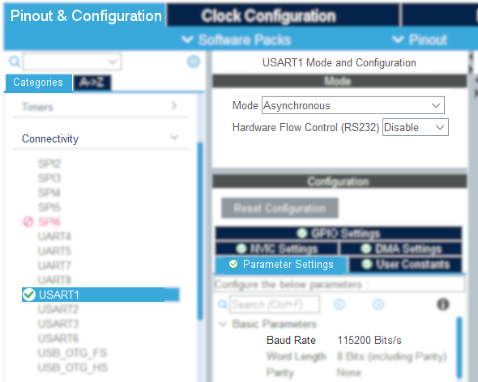

# FreeRTOS và Multitask

Xử lý đa nhiệm với hệ điều hành thời gian thực RTOS
\
> Nội dung trong học phần Hệ nhúng, phần __FreeRTOS và TouchGFXFreeRTOS và TouchGFX__

## Hoạt động

2 đèn led có sẵn trên board sẽ nháy sáng với chu kì và hiệu ứng khác nhau.

## Kết nối STM32F429 với ngoại vi

Sử dụng led sẵn có. Không thêm module phụ trợ.

|Dev Kit STM32F429zIT6-DISC1|
|:--|
|LD3 xanh / PG13 |
|LD4 đỏ / PG14 |

## Các bước lập trình

1. Tạo dự án mới.
2. Mở file __.ioc__, cấu hinh các chân __PG13, PG14__ (tương ứng với đèn led LD3, LD4) ở mode __GPIO Output__.\
   
   > Ở dòng cuối hình minh họa, đặt tên nhãn gợi nhớ __User Label = LD3__ để khi lập trình sẽ sử dụng define __LD3_Pin__ dễ hiểu hơn. Tương tự với __LD4__.
3. Mở file __.ioc__ và thiết lập xung nhịp đồng hồ CPU clock rate ở 90 MHz với 2 bước cấu hình như trong ảnh.
   - Kích hoạt __RCC__.\
    
   - Thiết lập __CPU Clock = 180MHz__.\
    
4. Vẫn ở file __.ioc__, câu hình __USART1__ ở chế độ __Asynchronous__, tốc độ __baudrate = 115200 bps__.
    

## Kết quả
